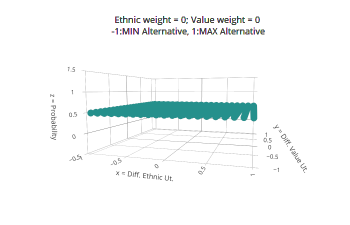
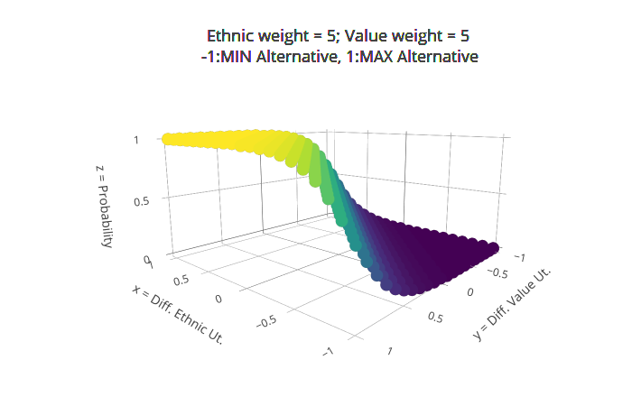
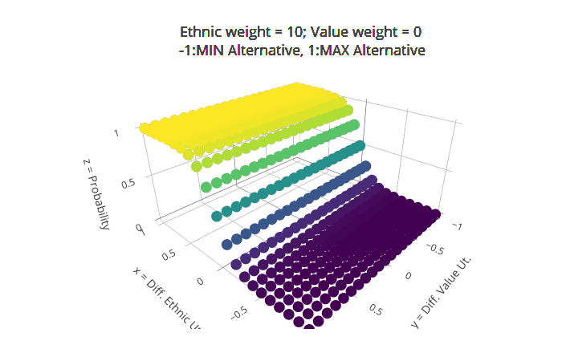
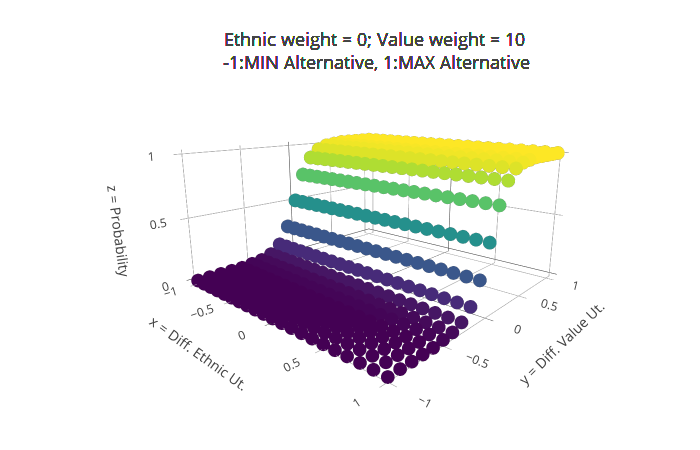
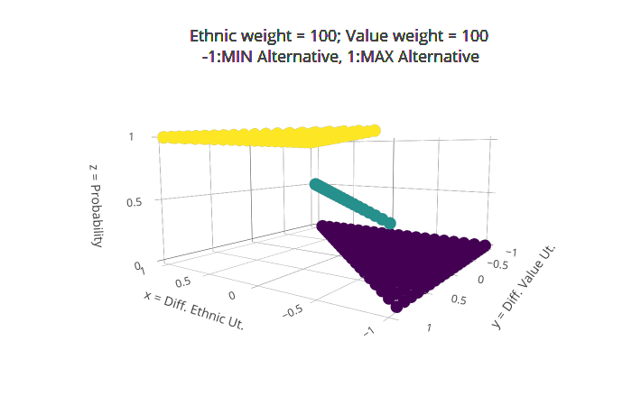
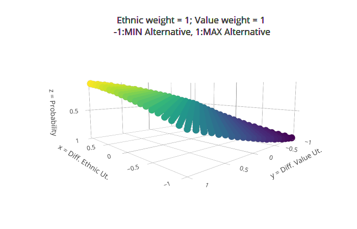

---
output:
  bookdown::pdf_document2:
    toc: false
 #   keep_tex: false
    fig_caption: yes
title: "Paper notes"
author: Rocco Paolillo
bibliography: "references.bib"
always_allow_html: yes
# target: BIGSSS Research Day by September 15th, presented  on October 25th. 6000 words: around 12 pages.
# csl: apa.csl # by default: Chicago style
header-includes:
- \usepackage{float}
- \usepackage{multirow}
- \usepackage{xcolor} 
- \usepackage{amsmath}
---

```{r setup, include=FALSE}
knitr::opts_chunk$set(echo = TRUE, fig.lp="fig:")

# install.packages("tinytex", repos = "https://cloud.r-project.org" )


library(knitr)
library(Hmisc)
library(ggplot2)
library(gridExtra)
library(ggpubr)
# library(kableExtra)
library(dplyr)
library(grid)
library(ggrepel)
library(magicfor)
# library(dplyr)
library(plot3D)
library(rgl)
library(plotly)
library(tidyr)
library(plyr)
library(rgl)
library(graphics)
library(cowplot)
library(magick) 


# Here functions that are used.

# Calculation ethnic utility (for each option)
# i_e: ethnic threshold (ideal point)
# M: right-side decreasing slope
# x: number agents in neighborhood with same color
# n: total number agents in neighborhood
# S: left-side increasing slope
# Note: if (x > n){U <- NA} to show the case number of agents in neighborhood different from 8, so that utility is calculated based on this, although x-axis in graph has 8 points  (excluded from calculation)

 

 #  f_eth <- function(i_e,M,x,n,S){
  #   if (x > n){
  #     U <- NA}else{
 #   if (x < round(n*i_e,digits = 2)){
  #    U <- (x / round((n*i_e),digits = 2)) * S
 #      }else {
 #      U <- M + ((1- (x/n))*(1-M))/(1-i_e)   
  #    }
#     round(U,digits = 2)
 #      }
#   }


  f_eth <- function(i_e,M,x,n,S){
   if (x > n){
     U <- NA}else{
     if (x < round(n*i_e,digits = 2)){
   U <- (x / round((n*i_e),digits = 2)) * S
      }else if (x > round((n*i_e),digits = 2)){
         U <- M + ((1- (x/n))*(1-M))/(1-i_e) 
        }else{
     U <- 1}
        round(U,digits = 3)
      }
 }


# Calculation value utility (for each option)

f_val <- function(e_w,ew_ng,M,i_v,S){
  if (round(abs(e_w-ew_ng), digits=2) <= i_v) {
    U <- 1
    }else{
      U <- (M + ((1-(round(abs(e_w-ew_ng), digits=2)))*(1-M))/(1-i_v)) * S
      }
  round(U,digits = 3)
  }
 

# Probability (random utility with logistic regression) to relocate

prob <- function(d_u_e,d_u_v,e_w,v_w){round(1 / (1 + exp((-(e_w*k)*(d_u_e)) + (-(v_w*k)*(d_u_v)))),digits= 2)}

# install.packages("tinytex", repos = "https://cloud.r-project.org" ) if debug needed?

```


The basic idea is to introduce a beta distribution for $\beta$ in the utility definition of neighborhood $j$ for agent $i$ :

$$
U^i_{(ej,yj)}   = \beta_xe_j + \beta_yv_j + \epsilon_j
$$

With $\beta_x$ the importance of ethnic composition $x_j$ of neighborhood $j$ and $\beta_y$ its value composition $y_i$.

To avoid confusion between parameter beta and beta distribution used in the simulation, $\beta_x$ is called ethnic weight (ew in R code), $\beta_y$ is called value weight (v_w in R code).

We want to compare different type of functions, in particular to compare the single-peaked function as modeled by [@zhang2011, graphic p. 174] with the Schelling's original threshold we also  used in the ACS paper, and a mixed one where utility increases until the ideal point as in Zhang, and remains constant at max. 1 when the ethnic composition exceeds the ideal point. The last function comes from the idea that it can be a realistic scenario in people's relocation choice. 

To have all of the functions coming from the same computation and reduce as much, I modified @zhang2011's formula, assuming max Utility = 1 and introducing 2 parameters to the formula, as in the simulation:\par
- $S[0,1]$, regulating the increasing left slope
- $M[0,1]$, regulating the decreasing right slope (as in Zhang)

# Ethnic Utility {-}

$$
U^i_e=
\begin{cases}
1, & \text{if} x =  n\times i_e, \\
\\
(\frac{x}{n \times i_e})\times S, & \text{if} \ x < n\times i_e, \\
\\
M + \frac{(1 - \frac{x}{n}) \times (1 - M)}{1 - i_e}, & \text{if} \ x > n\times i_e 
\end{cases}
$$

Where: \par
- $U^i_e$: Ethnic utility of agent i
- $x$: number of similar agents in the neighborhood
- $n$: total number of agents in the neighborhood
- $i_e$: desired ethnic composition

Below example of the three functions, reporting how $S$ and $M$ are set to calculate them. The example refer to desired compostion $50\%$ ($i_e = 0.5$). It was calculated out of a 8 agents neighborhood (with 4 agents of same ethnicity representing the $50 \%$)


```{r ethnic graph function, fig.width=6,fig.height= 8, fig.align="center",  include=TRUE, echo=FALSE}

# f2 <- function(p,M,x,n,S)

i_e = 0.5
M = 0
S = 1
n = 8

f0s <- f_eth(i_e,M,0,n,S)
f1s <- f_eth(i_e,M,1,n,S)
f2s <- f_eth(i_e,M,2,n,S)
f3s <- f_eth(i_e,M,3,n,S)
f4s <- f_eth(i_e,M,4,n,S)
f5s <- f_eth(i_e,M,5,n,S)
f6s <- f_eth(i_e,M,6,n,S)
f7s <- f_eth(i_e,M,7,n,S)
f8s <- f_eth(i_e,M,8,n,S)

i_e = 0.5
M = 1
S = 1
n = 8

f0c <- f_eth(i_e,M,0,n,S)
f1c <- f_eth(i_e,M,1,n,S)
f2c <- f_eth(i_e,M,2,n,S)
f3c <- f_eth(i_e,M,3,n,S)
f4c <- f_eth(i_e,M,4,n,S)
f5c <- f_eth(i_e,M,5,n,S)
f6c <- f_eth(i_e,M,6,n,S)
f7c <- f_eth(i_e,M,7,n,S)
f8c <- f_eth(i_e,M,8,n,S)


i_e = 0.5
M = 1
S = 0
n = 8

f0t <- f_eth(i_e,M,0,n,S)
f1t <- f_eth(i_e,M,1,n,S)
f2t <- f_eth(i_e,M,2,n,S)
f3t <- f_eth(i_e,M,3,n,S)
f4t <- f_eth(i_e,M,4,n,S)
f5t <- f_eth(i_e,M,5,n,S)
f6t <- f_eth(i_e,M,6,n,S)
f7t <- f_eth(i_e,M,7,n,S)
f8t <- f_eth(i_e,M,8,n,S)

Utility_S <- c(f0s,f1s,f2s,f3s,f4s,f5s,f6s,f7s,f8s)
Utility_C <- c(f0c,f1c,f2c,f3c,f4c,f5c,f6c,f7c,f8c)
Utility_T <- c(f0t,f1t,f2t,f3t,f4t,f5t,f6t,f7t,f8t)


# name_E <- paste0("Desired proportion i = ",i_e,"; M = ",M,"; S = ",S)
# plot(num_sim_col,Utility_T, xlab = "Similar ethnics neighborhood j", ylab = "Ethnic Utility",  main = "Ethnic Utility for neighborhood j of agent i",  sub = name_E)
# report_E <- paste0("M = ",M,"; S = ",S,"; Desired proportion i = ",i_e,"; Similar ethnics neighborhood j = ", seq(0, 8, by = 1), "; Utility ij = ", Utility_T)
# print(report_E)


# func_type <- c(rep("symmetric",9),rep("constant",9),rep("threshold",9))

x_graph <- rep(seq(0, 100, by = 12.5),3)
funct_symm <- c(rep("symmetric",9),rep("constant",9),rep("threshold",9))
utility_location <- c(Utility_S,Utility_C,Utility_T)

symmetric <- data.frame(x_graph[c(0:9)],utility_location[c(0:9)],funct_symm[c(0:9)])
constant <- data.frame(x_graph[c(10:18)],utility_location[c(10:18)],funct_symm[c(10:18)])
threshold <- data.frame(x_graph[c(19:27)],utility_location[c(19:27)],funct_symm[c(19:27)])

# symmetric
# constant
# threshold

symmetric_graph <- ggplot(symmetric,aes(x_graph[c(0:9)],utility_location[c(0:9)])) 
constant_graph <- ggplot(constant,aes(x_graph[c(10:18)],utility_location[c(10:18)])) 
threshold_graph <- ggplot(threshold,aes(x_graph[c(19:27)],utility_location[c(19:27)])) 

subt_cont_e <- paste0("Desired proportion i = ",i_e)

symmetric_plot <- symmetric_graph + geom_point() + theme_bw() + labs(x = "percentage similars",y = "Ethnic Utility j") + ggtitle("Symmetric Single Peaked (S=1,M=0) ",subtitle = subt_cont_e) + theme(plot.title = element_text(hjust = 0.5), plot.subtitle = element_text(hjust = 0.5)) + scale_y_continuous(limits =  c(0.0,1.0), breaks = seq(0.0,1.0,by = 0.25))
constant_plot <- constant_graph + geom_point() + theme_bw() + labs(x = "percentage similars",y = "Ethnic Utility j") + ggtitle("Linear + Constant (S=1,M=1)",subtitle = subt_cont_e) + theme(plot.title = element_text(hjust = 0.5), plot.subtitle = element_text(hjust = 0.5)) + scale_y_continuous(limits =  c(0.0,1.0), breaks = seq(0.0,1.0,by = 0.25))
threshold_plot <- threshold_graph + geom_point() + theme_bw() + labs(x = "percentage similars",y = "Ethnic Utility j") + ggtitle("Schelling Threshold (S=0,M=1)",subtitle = subt_cont_e) + theme(plot.title = element_text(hjust = 0.5), plot.subtitle = element_text(hjust = 0.5)) + scale_y_continuous(limits =  c(0.0,1.0), breaks = seq(0.0,1.0,by = 0.25))

suppressWarnings(
grid.arrange(symmetric_plot, constant_plot,threshold_plot, bottom = "Comparison of the three functions for ethnic utility of a neighborhood j")
)

```

# Value Utility {-}

$$
U^i_v=
\begin{cases}
1, & \text{if} \ e_w \leq i_v, \\
\\
\left(M + \frac{(1 - \mid{\overline{ew}_j - ew_i}\mid) \times (1 - M)}{1 - i_v}\right) \times S, & otherwise
\end{cases}
$$

Where: \par
- $U^i_v$: Ethnic utility of agent i
- $\overline{ew}_j$: average ethnic weight in neighborhood \textit{j}
- $ew_i$: ethnic weight of agent \textit{i}
- $i_e$: desired ethnic composition

*DOUBT*: for the value composition, have a distribution of opinions/beliefs for agents within ethnic groups, the value weight would be still  1 - e_w, and a parameter of how similar others are considered based on how they distantiate from the own opinion. This would be a comparison to Schelling's definition of similarity based on twofold, exhaustive and exclusive category (i.e. ethnicity), but rather on an cross-categorical, individual and constructed definition of similarity/desirability, and how important it is.

```{r value graph function, fig.width=6,fig.height=5, fig.align="center", include=TRUE, echo=FALSE}

# f_val <- function(e_w,ew_ng,M,i_v,S)

e_w <- 0.2
e_w_ng <- seq(0.0,1.0, by = 0.1)
i_v <- 0.1
S <- 1
M <- 0

fvf0p  <- f_val(e_w,0,M,i_v,S)
fvf1p  <- f_val(e_w,0.1,M,i_v,S)
fvf2p   <- f_val(e_w,0.2,M,i_v,S)
fvf3p   <- f_val(e_w,0.3,M,i_v,S)
fvf4p   <- f_val(e_w,0.4,M,i_v,S)
fvf5p   <- f_val(e_w,0.5,M,i_v,S)
fvf6p   <- f_val(e_w,0.6,M,i_v,S)
fvf7p   <- f_val(e_w,0.7,M,i_v,S)
fvf8p   <- f_val(e_w,0.8,M,i_v,S)
fvf9p  <- f_val(e_w,0.9,M,i_v,S)
fvf10p  <- f_val(e_w,1.0,M,i_v,S)

e_w <- 0.2
e_w_ng <- seq(0.0,1.0, by = 0.1)
i_v <- 0.1
S <- 0
M <- 0 #M can be either 0 or 1, M = 0 is for declining slope, M = 1 keeps utility = 1 for values out of range, so S = 0 keeps  the threshold  with values out of the distance equal 0
# M regulates the right side of the slope, S the left side of the slope


fvf0t <- f_val(e_w,0,M,i_v,S)
fvf1t  <- f_val(e_w,0.1,M,i_v,S)
fvf2t   <- f_val(e_w,0.2,M,i_v,S)
fvf3t   <- f_val(e_w,0.3,M,i_v,S)
fvf4t   <- f_val(e_w,0.4,M,i_v,S)
fvf5t   <- f_val(e_w,0.5,M,i_v,S)
fvf6t  <- f_val(e_w,0.6,M,i_v,S)
fvf7t   <- f_val(e_w,0.7,M,i_v,S)
fvf8t   <- f_val(e_w,0.8,M,i_v,S)
fvf9t  <- f_val(e_w,0.9,M,i_v,S)
fvf10t  <- f_val(e_w,1.0,M,i_v,S)


x_graph_val <- seq(0.0,1.0, by = 0.1) #rep(seq(0.0,1.0, by = 0.1),2)
uti_val_pf <- c(fvf0p,fvf1p,fvf2p,fvf3p,fvf4p,fvf5p,fvf6p,fvf7p,fvf8p,fvf9p,fvf10p)
uti_val_th <- c(fvf0t,fvf1t,fvf2t,fvf3t,fvf4t,fvf5t,fvf6t,fvf7t,fvf8t,fvf9t,fvf10t)

symm_val <- data.frame(x_graph_val,uti_val_pf)
threshold_val <- data.frame(x_graph_val,uti_val_th)

# funct_symm_v <- c(rep("symmetric",9),rep("threshold",9))
  
symm_val_graph <- ggplot(symm_val,aes(x_graph_val,uti_val_pf))
thres_val_graph <- ggplot(threshold_val,aes(x_graph_val,uti_val_th))

subt_cont_v <- paste0("Ethnic weight i = ",e_w,"; ","Desired distance = ",i_v)

symm_val_plot <- symm_val_graph + geom_point() + theme_bw() + labs(x = "Mean ethnic weight neighborhood j",y = "Value utility j") + ggtitle(label = "Symmetric Single Peaked (S=1,M=0) ",subtitle = subt_cont_v) + theme(plot.title = element_text(hjust = 0.5), plot.subtitle = element_text(hjust = 0.5))  + scale_x_continuous(breaks = seq(0.0,1.0,by = 0.1)) + scale_y_continuous(limits =  c(0.0,1.0), breaks = seq(0.0,1.0,by = 0.25))

thres_val_plot <- thres_val_graph + geom_point() + theme_bw() + labs(x = "Mean ethnic weight neighborhood j",y = "Value utility j") + ggtitle(label = "Threshold Schelling (S=0) ",subtitle = subt_cont_v) + theme(plot.title = element_text(hjust = 0.5), plot.subtitle = element_text(hjust = 0.5))  + scale_x_continuous(breaks = seq(0.0,1.0,by = 0.1)) + scale_y_continuous(limits =  c(0.0,1.0), breaks = seq(0.0,1.0,by = 0.25))

# symm_val_plot
# thres_val_plot


suppressWarnings(
grid.arrange(symm_val_plot, thres_val_plot, bottom = "Comparison of the two functions for value utility of a neighborhood j.")
)


```

Ethnic utility, separating ethnic_weight and ideal payoff for ethnicity (i_e) -> based on ethnicity of agents (color)
The ethnic weight follows the beta distribution, *maybe* report Blitzstein 4 beta cases, and anyway considering ethnic_weight and value_weight are complementary

Specify n > x <- U:NA in formula

```{r heatmap-log,  fig.width=5,fig.height=4,fig.cap="Probability to choose alternative location",fig.align="center", include=FALSE, echo=FALSE}

# # to add: -1 for MIN. Utility Alternative, +1 for MAX Alternative Utility
# 
# magic_for(print,silent = TRUE)
# 
# for (i in seq (-1.0,1.0, by = 0.1)){
#   eth_diff <- rep(i,21)
#   print(eth_diff)
# }
# 
# d_u_e <-  magic_result_as_vector()
# d_u_v <- rep(seq(-1,1,by = 0.1),21) 
# e_w <- 0
# v_w <- 1-e_w
# k <- 10
# 
# df <- data.frame(d_u_e,d_u_v,e_w,v_w)
# 
# title_cond_fin <- paste0("Ethnic weight = ",e_w*k,"; ","Value weight = ",v_w*k)
# ass <- mutate(df, prap = prob(d_u_e, d_u_v,e_w,v_w))
# fina_rast <- ggplot(ass,aes(d_u_e,d_u_v))
# 
#  plot_fina_rast <-  suppressWarnings(suppressMessages(
#     fina_rast + geom_raster(aes(fill = prap)) + theme_bw() + labs(x = "Diff. ethnic (alternative - current)",y = "Diff. value (alternative - current)") + labs(title = title_cond_fin, caption = "-1: Min Utility Alternative; 1: Max Utility Alternative") + theme(plot.title = element_text(hjust = 0.5), plot.subtitle = element_text(hjust=0.5),plot.caption = element_text(hjust=0.5)) 
#     + geom_vline(xintercept = 0, colour = "red", linetype = "dotted") + geom_hline(yintercept = 0, colour = "red", linetype = "dotted") + scale_fill_continuous(name = "Probability")
#   ))
#   
# 
#  fx <- d_u_e
#  fy <- d_u_v
#  fz <- ass$prap
#  
#  # persp(x = seq(-1, 1, by = 0.1),
#    #   y = seq(-1, 1, by = 0.1),
#    #   fz)
#  
#   d <- plot3d(fx,fy,fz,col="blue")
#   rgl.postscript("d.eps",fmt="eps")
#  
#  
#  test_trida <- plot_ly(x=fx,y=fy,z=fz, type="scatter3d", mode="markers", color=fz) %>% layout(legend = list(x = 0.1, y = 0.9))
#  #p <- export(p = last_plot(),file = "plotly.png", selenium = NULL)
#  #fx
#  
# # test_trid <- plot3d(df_3$a,df_3$b,df_3$C)
#  
# # plotly_IMAGE(test_trida, width = 500, height = 500, format = "png", scale = 2, out_file = "test.png")
#  
# #is.data.frame(ass)
# #  print(plot_fina_rast)
#  
# print(plot_fina_rast)
# 
# # knitr::include_graphics("gg.png" )
 
# plot3d(fx,fy,fz, col = "blue",xlab = "eth",ylab="val",zlab="prob", type = "s",size = 2)
 
```


```{r heat2,  fig.width=5,fig.height=4,fig.cap="Probability to choose alternative location",fig.align="center", include=FALSE, echo=FALSE}

# # to add: -1 for MIN. Utility Alternative, +1 for MAX Alternative Utility
# 
# magic_for(print,silent = TRUE)
# 
# for (i in seq (-1.0,1.0, by = 0.1)){
#   eth_diff <- rep(i,21)
#   print(eth_diff)
# }
# 
# 
# d_u_e <-  magic_result_as_vector()
# d_u_v <- rep(seq(-1,1,by = 0.1),21)
# 
# k <- 10
# 
# e_w <- 0
# v_w <- 1-e_w
# df <- data.frame(d_u_e,d_u_v,e_w,v_w)
# 
# title_cond_fin <- paste0("Ethnic weight = ",e_w*k,"; ","Value weight = ",v_w*k)
# fin_prob <- mutate(df, proba = prob(d_u_e, d_u_v,e_w,v_w))
# fina_rast <- ggplot(fin_prob,aes(d_u_e,d_u_v))
# 
#  plot_fina_rast <-  suppressWarnings(suppressMessages(
#     fina_rast + geom_raster(aes(fill = proba)) + theme_bw() + labs(x = "Diff. ethnic (alternative - current)",y = "Diff. value (alternative - current)") + labs(title = title_cond_fin, caption = "-1: Min Utility Alternative; 1: Max Utility Alternative") + theme(plot.title = element_text(hjust = 0.5), plot.subtitle = element_text(hjust=0.5),plot.caption = element_text(hjust=0.5)) 
#     + geom_vline(xintercept = 0, colour = "red", linetype = "dotted") + geom_hline(yintercept = 0, colour = "red", linetype = "dotted") + scale_fill_continuous(name = "Probability")
#   ))
#   
# 
#  fx <- d_u_e
#  fy <- d_u_v
#  fz <- ass$prap
#  
#  # persp(x = seq(-1, 1, by = 0.1),
#    #   y = seq(-1, 1, by = 0.1),
#    #   fz)
#  
# #  d <- plot3d(fx,fy,fz,col="blue")
# #  rgl.postscript("d.eps",fmt="eps")
#  
#  
#  test_trida <- plot_ly(x=fx,y=fy,z=fz, type="scatter3d", mode="markers", color=fz) 
#  #p <- export(p = last_plot(),file = "plotly.png", selenium = NULL)
#  #fx
#  
# # test_trid <- plot3d(df_3$a,df_3$b,df_3$C)
#  
# # plotly_IMAGE(test_trida, width = 500, height = 500, format = "png", scale = 2, out_file = "test.png")
#  
# #is.data.frame(ass)
# #  print(plot_fina_rast)
# 
# print(test_trida)
# print(plot_fina_rast)
# 
# df

# knitr::include_graphics("gg.png" )
 
# plot3d(fx,fy,fz, col = "blue",xlab = "eth",ylab="val",zlab="prob", type = "s",size = 2)
 
```


$$
P_j=\frac{1}{1 + \exp((-ew\cdot k\times \Delta_{U_e})+(-vw\cdot k \times \Delta_{U_v}))}
% P_{xj}=\frac{1}{1 + \exp((-ew\cdot k\times \Delta(U_e^x,U_e^j))+(-vw\cdot k \times \Delta(U_v^x,U_v^j))}
$$

Where:\par
- $P_j$: Probability to relocate to alternative neighborhood \textit{j} leaving the current neighborhood
- $ew$:  Ethnic weight of agent \textit{i}
- $\Delta_{U_e}$: Ethnic Utility Difference (alternative - current)
- $vw$: Value weight \textit{i}
- $\Delta_{U_e}$: Value Utility Difference (alternative - current)
- $k$: constant

The idea of $k$ constant is to include the parameter of determinism in the random utility formula, i.e. from 0: the probabiity to choose the alternative is totally random due to random term $\epsilon$, to infinity, the best option is taken with probability equal to 1. To reduce the number of parameters, and being constitent with the conceptual model, I derive the parameter for ethnic utility from the ethnic weight $ew$ and the parameter for value utility from the value weight $vw$ in the agent-based  model. Remember that $ew$ ranges $[0,1]$ according to beta distribution, and $vw$ is calculated as $1-ew$. The parameter is calculated as $k\cdot ew$ and $k \cdot vw$, meaning that with $k=10$, the parameter for ethnic utility will range from 0 to 10, $k=100$, range from 0 to 100, $k = 0$: all agents will have parameter equal 0. It will be one slider in the agent-based model.\par
The aim of the logistic function above is to implement the random  utility for a binary choice for the agent between the current location $x$ and alternative location $j$, with $P_{xj}=0$ meaning the agent stays on the current location, $P_{xj}=1$ the agent moves to the alternative location $j$.\par
Below I report some graphs on $P_{xj}$ where the logistic funtion above is implemented for each combination of ethnic utility difference $\Delta_{U_e}$ and value utility difference $\Delta_{U_v}$. These are the possible values expected from the agent-based model: assuming that both the ethnic and value utility for each location ranges from 0 to 1, the difference (alternative - current) ranges from -1 (alternative = 0, current = 1), to 1 (alternative =1, current = 0), with 0 meaning equal utility sizes. This creates 11 levels  for each utility, $\times$ 2 number of utility = 441 conditions. The aim of the graphs was to relate the probability as function of 2 dimensions, so I use the heatmaps in fig.\ref{fig:heatmaps}. They have the same content of the 3D plots in fig.\ref{fig:prob3D} which I think serve better the scope: in the R code you can interact with the graph and see actual probability for each point, but need to do it from the RStudio interface.\par
Each graph reports the parameter ethnic weight $ew \cdot k$ and parameter value weight $vw \cdot k$. In all conditions $k = 10$, which I saw shows most realistic scenarios, i.e. lower probability for lower ethnic/utility difference. To check if the random utility for binary choice is correctly implemented, $P_{xj}=0.50$ with $ew \cdot k = 0$ and $vw \cdot k = 0$, meaning the choice between current and alternative location is totally random. In the last condition $ew \cdot k = 100$ and $vw \cdot k = 100$, $P_{xj}=0$ for all conditions where current location is higher in both types of utility (below the diagonal), shifts to $P_{xj}=1$ for all conditions with both utilities higher in the alternative location (above the diagonal), and $P_{xj}=0.5$ on the diagonal where the alternatives have same utility with difference equal 0. So the choice is totally dependent on the characteristic of the neighborhood, with the best option being taken. I think it can confirm the random utility framework for two options. 

```{r heatmaps,  fig.width=12,fig.height=12,fig.cap="Probability to choose alternative location",fig.align="center", include=TRUE, echo=FALSE}

# to add: -1 for MIN. Utility Alternative, +1 for MAX Alternative Utility

magic_for(print,silent = TRUE)

for (i in seq (-1.0,1.0, by = 0.1)){
  eth_diff <- rep(i,21)
  print(eth_diff)
}


d_u_e <-  magic_result_as_vector()
d_u_v <- rep(seq(-1,1,by = 0.1),21)

k <- 10

#e_w <- 0
#v_w <- 1-e_w


prob_comb <- function(a){
title_cond_fin <- paste0("Ethnic weight = ",a$e_w*k,"; ","Value weight = ",a$v_w*k)
# fin_prob <- mutate(a, proba = prob(d_u_e, d_u_v,e_w,v_w))
fina_rast <- ggplot(a,aes(d_u_e,d_u_v))

 plot_fina_rast <-  suppressWarnings(suppressMessages(
    fina_rast + geom_raster(aes(fill = proba)) + theme_bw() + labs(x = "Diff. ethnic (alternative - current)",y = "Diff. value (alternative - current)") + labs(title = title_cond_fin, caption = "-1: Min Utility Alternative; 1: Max Utility Alternative") + theme(plot.title = element_text(hjust = 0.5), plot.subtitle = element_text(hjust=0.5),plot.caption = element_text(hjust=0.5)) 
    + geom_vline(xintercept = 0, colour = "red", linetype = "dotted") + geom_hline(yintercept = 0, colour = "red", linetype = "dotted") + scale_fill_continuous(name = "Probability",limits=c(0,1), breaks=seq(0,1,0.25))
  ))
 # print(plot_fina_rast)
 
 # fx <- d_u_e
# fy <- d_u_v
#  fz <- df_0$prob
  
# test_trida <- plot_ly(x=fx,y=fy,z=fz, type="scatter3d", mode="markers", color=fz) 
}

df_0 <- mutate(data.frame(d_u_e,d_u_v,e_w=0,v_w=0), proba = prob(d_u_e, d_u_v,e_w,v_w))
df_05 <- mutate(data.frame(d_u_e,d_u_v,e_w=0.5,v_w=0.5),proba = prob(d_u_e, d_u_v,e_w,v_w))
df_maxe <- mutate(data.frame(d_u_e,d_u_v,e_w=1,v_w=0),proba = prob(d_u_e, d_u_v,e_w,v_w))
df_maxv <- mutate(data.frame(d_u_e,d_u_v,e_w=0,v_w=1),proba = prob(d_u_e, d_u_v,e_w,v_w))
df_r <- mutate(data.frame(d_u_e,d_u_v,e_w=0.1,v_w=0.1),proba = prob(d_u_e, d_u_v,e_w,v_w))
df_1 <- mutate(data.frame(d_u_e,d_u_v,e_w=10,v_w=10),proba = prob(d_u_e, d_u_v,e_w,v_w))

# df_05

plot_0 <- prob_comb(df_0)
plot_05 <- prob_comb(df_05)
plot_maxe <- prob_comb(df_maxe)
plot_maxv <- prob_comb(df_maxv)
plot_r <- prob_comb(df_r)
plot_1 <- prob_comb(df_1)

grid.arrange( plot_0,plot_05,plot_maxe,plot_maxv,plot_r,  plot_1,nrow=3,ncol=2)

```


```{r prob3D,  fig.width=18,fig.height=18,fig.cap="Probability to choose alternative location 3D",fig.align="center", include=TRUE, echo=FALSE}

 prob_3d <- function(b){
 fx <- d_u_e
  fy <- d_u_v
  fz <- b$prob
  
  tit <- paste0("Ethnic weight = ",b$e_w*k,"; ","Value weight = ",b$v_w*k, "\n\r -1:MIN Alternative, 1:MAX Alternative")
 
   test_trida <- plot_ly(x=fx,y=fy,z=fz, type="scatter3d", color=fz, mode="markers")  %>% 
    layout(
         #  title =  "Prob. relocate to alternative", font=list(size = 10),
     scene = list(
       xaxis = list(title = "x = Diff. Ethnic Ut."),
       yaxis = list(title = "y = Diff. Value Ut."),
       zaxis = list(title = "z = Probability")
     ), annotations = (list(x = 0.5, y = 1, text = tit ,
                           showarrow = F, font=list(size=18) #,
     #  xref='paper', yref='paper',
      # xanchor='right', yanchor='auto', xshift=0, yshift=0,
   #  font=list(size=15, color="red")
     ))
  # , legend = list(color = fz)
   ) %>% hide_colorbar() 

 test_trida 

 }

# 
# 
#  plot3d_0 <- prob_3d(df_0)
#  plot3d_5 <- prob_3d(df_05)
#  plot3d_maxe <- prob_3d(df_maxe)
#  plot3d_maxv <- prob_3d(df_maxv)
#  plot3d_1 <- prob_3d(df_1)
#  plot3d_r <- prob_3d(df_r)

                  # prob_3d(df_0)
                  # prob_3d(df_05)
                  # prob_3d(df_maxe)
                  # prob_3d(df_maxv)
                  # prob_3d(df_1)
                  # prob_3d(df_r)
  # 
  

# p_0 <- image_read("3d_0_0.png") %>% image_trim()
# p_5 <- image_read("3d_5_5.png") %>% image_trim()
# p_10_0 <- image_read("3d_10_0.png") %>% image_trim()
# p_0_10 <- image_read("3d_0_10.png") %>% image_trim()
# p_100 <- image_read("3d_100_100.png") %>% image_trim()
# p_1 <- image_read("3d_1_1.png") %>% image_trim()

de <- ggdraw() + draw_image("3d_0_0.png")
fe <- ggdraw() + draw_image("3d_5_5.png")
te <- ggdraw() + draw_image("3d_10_0.png")
ne <- ggdraw() + draw_image("3d_0_10.png")
se <- ggdraw() + draw_image("3d_100_100.png")
ze <- ggdraw() + draw_image("3d_1_1.png")
# 
grid.arrange(de,fe,te,ne,ze,se,ncol=2,nrow=3)

# 
# 
# 
# 
# 
# 

```

```{r logistic,  fig.width=4,fig.height=3, fig.align="center", include=TRUE, echo=FALSE}

# to add: -1 for MIN. Utility Alternative, +1 for MAX Alternative Utility

for (d_u_e in seq (-1.0,1.0, by = 0.1)){
  
e_w <- 100
v_w <- 100
k <- 10

# d_u_e <- -1

dis_1neg   <- prob(d_u_e,-1.0,e_w,v_w)
dis_0.9neg <- prob(d_u_e,-0.9,e_w,v_w)
dis_0.8neg <- prob(d_u_e,-0.8,e_w,v_w)
dis_0.7neg <- prob(d_u_e,-0.7,e_w,v_w)
dis_0.6neg <- prob(d_u_e,-0.6,e_w,v_w)
dis_0.5neg <- prob(d_u_e,-0.5,e_w,v_w)
dis_0.4neg <- prob(d_u_e,-0.4,e_w,v_w)
dis_0.3neg <- prob(d_u_e,-0.3,e_w,v_w)
dis_0.2neg <- prob(d_u_e,-0.2,e_w,v_w)
dis_0.1neg <- prob(d_u_e,-0.1,e_w,v_w)
dis_0   <- prob(d_u_e,0.0,e_w,v_w)
dis_0.1 <- prob(d_u_e,0.1,e_w,v_w)
dis_0.2 <- prob(d_u_e,0.2,e_w,v_w)
dis_0.3 <- prob(d_u_e,0.3,e_w,v_w)
dis_0.4 <- prob(d_u_e,0.4,e_w,v_w)
dis_0.5 <- prob(d_u_e,0.5,e_w,v_w)
dis_0.6 <- prob(d_u_e,0.6,e_w,v_w)
dis_0.7 <- prob(d_u_e,0.7,e_w,v_w)
dis_0.8 <- prob(d_u_e,0.8,e_w,v_w)
dis_0.9 <- prob(d_u_e,0.9,e_w,v_w)
dis_1   <- prob(d_u_e,1.0,e_w,v_w)

  
  value_difference <- seq(-1.0,1.0, by = 0.1)
#  prob_relocation <- seq(0.0, 1.0,  by = 0.1)
  
  prob_choice <- c(dis_1neg,dis_0.9neg,dis_0.8neg,dis_0.7neg,dis_0.6neg,dis_0.5neg,dis_0.4neg,dis_0.3neg,dis_0.2neg,dis_0.1neg,dis_0,dis_0.1,dis_0.2,dis_0.3,dis_0.4,dis_0.5,dis_0.6,dis_0.7,dis_0.8,dis_0.9,dis_1)
 
 
  title_cond_prob <- paste0("PROB ALT","Diff eth = ",d_u_e,"Ew = ",e_w*10,"Vw = ",v_w*10)
   
  report_prob <- na.omit(data.frame(value_difference,prob_choice))
  
  plot_report_prob <- ggplot(report_prob,aes(value_difference,prob_choice))
  
 final_prob <-  suppressWarnings(suppressMessages(
    plot_report_prob + geom_point() + theme_bw() + labs(x = "DIFF VAL",y = "Probability") + ggtitle(label = title_cond_prob) + theme(plot.title = element_text(hjust = 0.5)) + scale_y_continuous(limits =  c(0.0,1.0), breaks = seq(0.0,1.0,by = 0.25)) + scale_x_continuous(limits =  c(-1,1), breaks = seq(-1,1,by = 0.2)) + geom_vline(xintercept = 0, colour = "red", linetype = "dotted") + geom_hline(yintercept = 0.5, colour = "red", linetype = "dotted") 
  ))
  
  plot(final_prob)
  

}


```


```{r ethnic utility individual-run,fig.width=4,fig.height= 3, fig.align="center", fig.pos="H", include=TRUE, echo=FALSE}


# f2 <- function(p,M,x,n,S)

i_e = 0.2
S = 0
M = 1
n = 6

f0m <- f_eth(i_e,M,0,n,S)
f1m <- f_eth(i_e,M,1,n,S)
f2m <- f_eth(i_e,M,2,n,S)
f3m <- f_eth(i_e,M,3,n,S)
f4m <- f_eth(i_e,M,4,n,S)
f5m <- f_eth(i_e,M,5,n,S)
f6m <- f_eth(i_e,M,6,n,S)
f7m <- f_eth(i_e,M,7,n,S)
f8m <- f_eth(i_e,M,8,n,S)

# num_sim_col <- seq(0, 8, by = 1)
Utility_E <- c(f0m,f1m,f2m,f3m,f4m,f5m,f6m,f7m,f8m)
# name_E <- paste0("Desired proportion i = ",i_e,"; M = ",M,"; S = ",S)
 
# plot(num_sim_col,Utility_E, xlab = "Similar ethnics neighborhood j", ylab = "Ethnic Utility",  main = "Ethnic Utility for neighborhood j of agent i",  sub = name_E)

#report_E <- paste0("M = ",M,"; S = ",S,"; Desired proportion i = ",i_e,"; Similar ethnics neighborhood j = ", seq(0, 8, by = 1), "; Utility ij = ", Utility_E)


M. <- rep(M,9)
S. <- rep(S,9)
prop_des <- rep(i_e,9)
num_tot <- rep(n,9)
num_sim <- seq(0, 8, by = 1)

report_E <- na.omit(data.frame(M.,S.,prop_des,num_tot,num_sim,Utility_E))

title_cond <- paste0("Desired proportion = ", i_e,"; ", "S = ", S,"; " ,"M = ", M)

plot_report_E <- ggplot(report_E,aes(num_sim,Utility_E))

suppressWarnings(suppressMessages(
plot_report_E + geom_point() + theme_bw() + labs(x = "Number similar agents in j",y = "Ethnic Utility j") + ggtitle(label = title_cond) + theme(plot.title = element_text(hjust = 0.5)) + scale_y_continuous(limits =  c(0.0,1.0), breaks = seq(0.0,1.0,by = 0.25)) + scale_x_continuous(limits =  c(0,n), breaks = seq(0,n,by = 1))
))


knitr::kable(report_E,align="c") # much better printed visualization

```


```{r value individual run,fig.width=5,fig.height= 3, fig.align="center", fig.pos="H", include=TRUE, echo=FALSE }

e_w <- 0.4
i_v <- 0.2
S  <- 1
M <- 0 #S regulates the left side of the slope, M the right side


fv0d2 <- f_val(e_w,0,M,i_v,S)
fv1d2 <- f_val(e_w,0.1,M,i_v,S)
fv2d2 <- f_val(e_w,0.2,M,i_v,S)
fv3d2 <- f_val(e_w,0.3,M,i_v,S)
fv4d2 <- f_val(e_w,0.4,M,i_v,S)
fv5d2 <- f_val(e_w,0.5,M,i_v,S)
fv6d2 <- f_val(e_w,0.6,M,i_v,S)
fv7d2 <- f_val(e_w,0.7,M,i_v,S)
fv8d2 <- f_val(e_w,0.8,M,i_v,S)
fv9d2 <- f_val(e_w,0.9,M,i_v,S)
fv10d2 <- f_val(e_w,1.0,M,i_v,S)


# name_V <- paste0("Ethnic weight i = ", e_w,"; desired distance i = ",i_v,"; M = ",M,"; S = ",S)

mean_ew_ng <- seq(0.0, 1.0, by = 0.1)
ew_agent <- rep(e_w,11)
Utility_V <- c(fv0d2,fv1d2,fv2d2,fv3d2,fv4d2,fv5d2,fv6d2,fv7d2,fv8d2,fv9d2,fv10d2)
Mv <- rep(M,11)
Sv <- rep(S,11)
des_dist <- rep(i_v,11)

report_V <- na.omit(data.frame(Mv,Sv,des_dist,ew_agent,mean_ew_ng,Utility_V))

title_cond_V <- paste0("Ethnic weight i = ", e_w,"; desired distance i = ",i_v,"\n\r","M = ",M,"S = ",S)

plot_report_V <- ggplot(report_V,aes(mean_ew_ng,Utility_V))

suppressWarnings(suppressMessages(
plot_report_V + geom_point() + theme_bw() + labs(x = "Mean ethnic weight j",y = "Value Utility j") + ggtitle(label = title_cond_V) + theme(plot.title = element_text(hjust = 0.5)) + scale_y_continuous(limits =  c(0.0,1.0), breaks = seq(0.0,1.0,by = 0.25)) + scale_x_continuous(limits =  c(0,1), breaks = seq(0,1,by = 0.1))
))


# plot(value_mean_neighborhood,Utility_V, xlab = "Mean ethnic weight neighborhood j", ylab = "Value Utility neighborhood j",  main = "Value Utility for neighborhood j of agent i",  sub = name_V)

# report_v <- paste0(name_V,"; Mean ethnic weight j = ", seq(0.0, 1.0, by = 0.1), "; Utility ij = ", Utility_V)

knitr::kable(report_V,align="c") # much better printed visualization

# print(final_v)
# print(final_repV)


```


```{r ANNEX - ethnic_multiple_run, moore neighborhood, include=TRUE, echo=FALSE}


# f2 <- function(p,M,x,n,S)

#i_e = 0.5
M = 0
S = 1
n = 8

for (i_e in seq (0.0,1.0, by = 0.1)){
  
f0m <- f_eth(i_e,M,0,n,S)
f1m <- f_eth(i_e,M,1,n,S)
f2m <- f_eth(i_e,M,2,n,S)
f3m <- f_eth(i_e,M,3,n,S)
f4m <- f_eth(i_e,M,4,n,S)
f5m <- f_eth(i_e,M,5,n,S)
f6m <- f_eth(i_e,M,6,n,S)
f7m <- f_eth(i_e,M,7,n,S)
f8m <- f_eth(i_e,M,8,n,S)

#num_sim_col <- seq(0, n, by = 1)
Utility_E <- c(f0m,f1m,f2m,f3m,f4m,f5m,f6m,f7m,f8m)
#name_E <- paste0("Desired proportion i = ",i_e,"; M = ",M,"; S = ",S)

#plot(num_sim_col,Utility_Es, xlab = "Similar ethnics neighborhood j", ylab = "Ethnic Utility", ylim = c(0,1),xlim = c(0,n),  main = "Ethnic Utility for neighborhood j of agent i",  sub = name_E)

#report_Es <- paste0("M = ",M,"; S = ",S,"; Desired proportion i = ",i_e,"; Similars in j= ", seq(0, n, by = 1), "; Utility ij = ", Utility_Es)

#print(report_Es)


M. <- rep(M,9)
S. <- rep(S,9)
prop_des <- rep(i_e,9)
num_tot <- rep(n,9)
num_sim <- seq(0, 8, by = 1)

report_E <- na.omit(data.frame(M.,S.,prop_des,num_tot,num_sim,Utility_E))

title_cond <- paste0("Desired proportion = ", i_e,"; ", "S = ", S,"; " ,"M = ", M)

plot_report_E <- ggplot(report_E,aes(num_sim,Utility_E))

final_E <- suppressWarnings(suppressMessages(
plot_report_E + geom_point() + theme_bw() + labs(x = "Number similar agents in j",y = "Ethnic Utility j") + ggtitle(label = title_cond) + theme(plot.title = element_text(hjust = 0.5)) + scale_y_continuous(limits =  c(0.0,1.0), breaks = seq(0.0,1.0,by = 0.25)) + scale_x_continuous(limits =  c(0,n), breaks = seq(0,n,by = 1)) 
))


final_repE <- knitr::kable(report_E,align="c") # much better printed visualization

print(final_E)
print(final_repE)

}
```

Value utility, based on agents' desired distance (i_v) between the agent's ethnic_weight (e_w) and neighborhood's average ethnic_weight (calculated out of agents residing there)
Calculate ethnic weight average of neighborhoods with n agents > 0.


 **check:** Explain how S and M vary for the constant function, the comment seems lost

```{r ANNEX- value_similarity, echo=FALSE }

i_v <- 0.1
S  <- 1
M <- 0 #different values  of M do change results, even for M < 1

for (e_w in seq (0.0,1.0, by = 0.1)){

fv0d2 <- f_val(e_w,0,M,i_v,S)
fv1d2 <- f_val(e_w,0.1,M,i_v,S)
fv2d2 <- f_val(e_w,0.2,M,i_v,S)
fv3d2 <- f_val(e_w,0.3,M,i_v,S)
fv4d2 <- f_val(e_w,0.4,M,i_v,S)
fv5d2 <- f_val(e_w,0.5,M,i_v,S)
fv6d2 <- f_val(e_w,0.6,M,i_v,S)
fv7d2 <- f_val(e_w,0.7,M,i_v,S)
fv8d2 <- f_val(e_w,0.8,M,i_v,S)
fv9d2 <- f_val(e_w,0.9,M,i_v,S)
fv10d2 <- f_val(e_w,1.0,M,i_v,S)


# name_V <- paste0("Ethnic weight i = ", e_w,"; desired distance i = ",i_v,"; M = ",M,"; S = ",S)

mean_ew_ng <- seq(0.0, 1.0, by = 0.1)
ew_agent <- rep(e_w,11)
Utility_V <- c(fv0d2,fv1d2,fv2d2,fv3d2,fv4d2,fv5d2,fv6d2,fv7d2,fv8d2,fv9d2,fv10d2)
Mv <- rep(M,11)
Sv <- rep(S,11)
des_dist <- rep(i_v,11)

report_V <- na.omit(data.frame(Mv,Sv,des_dist,ew_agent,mean_ew_ng,Utility_V))

title_cond_V <- paste0("Ethnic weight i = ", e_w,"; desired distance i = ",i_v,"; M = ",M,"; S = ",S)

plot_report_V <- ggplot(report_V,aes(mean_ew_ng,Utility_V))

final_v <- suppressWarnings(suppressMessages(
plot_report_V + geom_point() + theme_bw() + labs(x = "Mean ethnic weight j",y = "Value Utility j") + ggtitle(label = title_cond_V) + theme(plot.title = element_text(hjust = 0.5)) + scale_y_continuous(limits =  c(0.0,1.0), breaks = seq(0.0,1.0,by = 0.25)) + scale_x_continuous(limits =  c(0,1), breaks = seq(0,1,by = 0.1))
))


# plot(value_mean_neighborhood,Utility_V, xlab = "Mean ethnic weight neighborhood j", ylab = "Value Utility neighborhood j",  main = "Value Utility for neighborhood j of agent i",  sub = name_V)

# report_v <- paste0(name_V,"; Mean ethnic weight j = ", seq(0.0, 1.0, by = 0.1), "; Utility ij = ", Utility_V)

final_repV <- knitr::kable(report_V,align="c") # much better printed visualization

print(final_v)
print(final_repV)

}

```

Once calculated the ethnic utility and value utility, apply prob above (logistic function) in the decision rule of the agent, with prob(to_new) >= random-float 0-1


```{r logistic in sequence, to test with parameters, to be deleted}
# 
# prob <- function(d_u_e,d_u_v,par_e,par_v){round(1 / (1 + exp(-par_e*(d_u_e) + (-par_v*(d_u_v)))),digits= 2)}
# 
# for (d_u_e in seq (-1.0,1.0, by = 0.1)){
#   
# par_e <- 10
# par_v <- 10 - par_e
# 
# # d_u_e <- -1
# 
#   dis_0p   <- prob(d_u_e,0.0,par_e,par_v)
# dis_0.1p <- prob(d_u_e,0.1,par_e,par_v)
# dis_0.2p <- prob(d_u_e,0.2,par_e,par_v)
# dis_0.3p <- prob(d_u_e,0.3,par_e,par_v)
# dis_0.4p <- prob(d_u_e,0.4,par_e,par_v)
# dis_0.5p <- prob(d_u_e,0.5,par_e,par_v)
# dis_0.6p <- prob(d_u_e,0.6,par_e,par_v)
# dis_0.7p <- prob(d_u_e,0.7,par_e,par_v)
# dis_0.8p <- prob(d_u_e,0.8,par_e,par_v)
# dis_0.9p <- prob(d_u_e,0.9,par_e,par_v)
# dis_1p  <- prob(d_u_e,1.0,par_e,par_v)
# dis_0.1negp <- prob(d_u_e,-0.1,par_e,par_v)
# dis_0.2negp <- prob(d_u_e,-0.2,par_e,par_v)
# dis_0.3negp <- prob(d_u_e,-0.3,par_e,par_v)
# dis_0.4negp <- prob(d_u_e,-0.4,par_e,par_v)
# dis_0.5negp <- prob(d_u_e,-0.5,par_e,par_v)
# dis_0.6negp <- prob(d_u_e,-0.6,par_e,par_v)
# dis_0.7negp <- prob(d_u_e,-0.7,par_e,par_v)
# dis_0.8negp <- prob(d_u_e,-0.8,par_e,par_v)
# dis_0.9negp <- prob(d_u_e,-0.9,par_e,par_v)
# dis_1negp   <- prob(d_u_e,-1.0,par_e,par_v)
#   
#   value_difference <- seq(-1.0,1.0, by = 0.1)
#   prob_relocation <- seq(0.0, 1.0,  by = 0.1)
#   
#   prob_choicep <- c(dis_1negp,dis_0.9negp,dis_0.8negp,dis_0.7negp,dis_0.6negp,dis_0.5negp,dis_0.4negp,dis_0.3negp,dis_0.2negp,dis_0.1negp,dis_0p,dis_0.1p,dis_0.2p,dis_0.3p,dis_0.4p,dis_0.5p,dis_0.6p,dis_0.7p,dis_0.8p,dis_0.9p,dis_1p)
#   
#   name_diff <- paste0("Note: "," Ethnic parameter = ", par_e," ;"," Value parameter = ", par_v, 
#                       "\r\n Utility Difference -1 = MIN Utility Alternative, 1 = MAX Utility Alternative")
#   
#   name_diff_title <-paste0("Probability to move to alternative","\r\n Difference Ethnic Utility (Alternative - Current) = ", d_u_e)
#   
# plot(value_difference,prob_choicep, xlab = "x-axis: Difference Value Utility (Alternative - Current) \r\n",ylab = "probability", main = name_diff_title, sub = name_diff,ylim = c(0,1), yaxt = 'n')
# axis(2,at=seq(0.0, 1.0, by = 0.25))

#}


```


# Component of probability of the choice

- Object of choice: neighborhood
- Choice: relocate to a neighborhood
- Utility: payoff one is likely to accept to make the choice, i.e. to relocate to one neighborhood (or stay on current one). In @zhang2004 it is made up of:
  - deterministic component $U$: how much people desire/value one preference  in order to make the choice as ideal payoff, e.g. degree of ethnic concentration (e.g. max utility = 1 at 100% similars). @zhang2004 uses a single-peaked function (vs maximization).
  - random term $\epsilon$ that refers to other characteristics of the option, i.e. the neighborhood, that influence the choice but independent of utility payoff. In regression models  this is the random  error terms. Random utility models in abm recreate with the exponential function, so that not always the best option according to the deterministic component $U$ is chosen.
- Probability of the choice: $\beta u (.) + \epsilon$\, which is conceptually different but related to payoff $u$
  - $\beta$ is a parameter indicating how much the characteristic of the option is important in the probability to make a choice, or the random term $\epsilon$. It is modeled as a positive constant: the lower is $\beta$, the higher is random term $\epsilon$, i.e. other random characteristics, are relevant to choose one neighborhood. The higher is $\beta$, the lower will be the importance of random term $\epsilon$ and higher the importance of deterministic utility component to make a choice, i.e. moving to the neighborhood.
\


# Aim of the paper

- Independent of the ideal payoff $u$ people have for one characteristic of the neighborhood, my question is why someone should give more importance to that characteristic over the others, that is:
\par
why should $\beta$ vary among individuals?
\par
An answer in @esser2010 is social, educational, economic capital and how it translates into the investment of people into receiving context/ethnic context and his general suggestion. For instance:
  - The lower an agent speaks a language, the higher the need for aggregating with co-ethnics would be, so to increase $\beta_{ethnic}$ independently of what is the ideal payoff for ethnic composition of the neighborhood;
  - the higher is social mobility intention either as investment or value in the own community, the higher the wealth (socio-economic status) of the neighborhood would be $\beta_{status}$
  - the higher the need to associate with people sharing the same values of local community (receiving context in Esser [@esser2010] (e.g. political orientations, norm beliefs...) even as strategy for crossing ethnic boundaries [@wimmer2013], the higher the composition of value-orientation would become with increase of $\beta_{value}$ 
- Costs of relocation can be included as costs that hinder relocation despite the choice. This can be one application of  @esser2010's definition of costs as limit to the investment on the receving context option. In @esser2010 costs is loosely derived from social, economic and cultural capital milieu and are basically conceptualized upon the concrete choice actors (i.e. migrants) want to engage in, costs of relocation can be one of many.

- In the ACS paper [@paolillo2018] we focused on the interplay of different homophily preferences in Schelling's threshold model and diffent type of segregation that emerge. With this direction the next paper could link to the ACS paper [@paolillo2018] by:
  * addressing the reason why people would have preference for one characteristic over the other
  * what's the effect of people holding different preferences at same grades, while in the ACS they were exclusive tolerant: value, intolerant: ethnicity
  * extension to the random utility model as in @zhang2004 would distinguish between the ideal payoff $u$ for a characteristic and how important is that characteristic to people $\beta$
  * an additional point to random utility models would be to link $\beta$ to needs and resources of people as in @esser2010. This has some advantages to me:
    - relative group size and ethnic boundary making in @esser2010 are supposed to influence probability to make a choice.In the ACS paper we included symbolic boundaries through the definition of similarity and relative group size, now we would include the overall frame of the model with need $\rightarrow$ change in $\beta$) and costs of relocation
    - as in the original Schelling [@schelling1969;@schelling1971] and other literature, homophily *per se* is a mechanism which describes the aggregation dynamics, but it does not provide causal mechanism on why people should aggregate based on one dimension over the others. This frame of the paper could fill this point
    - foster the linkage between @esser2010's speculation and Schelling's model, so to benefit the long term agenda of the project
    - deeper definition of utility frame and rational choice, linking to the literature in abm and concretisize @esser2010's model itself, which was elaborated as a summa of general and abstract rational choice

- Linking $\beta$ to needs and including costs, $\beta u (.) + \epsilon$ should become something like $$N_{e} U_{e} + N_{v} U_{v} + N_{s} U_{s} - C$$ where $N$ =  needs, $C$ = costs and $e,v,s$ the ethnic, value and socio-economic status dimension. The random term $\epsilon$ is implemented through the exponential function.

# Notes on the model

- Now agents' characteristics of ethnicity, value and ses are nested. I think it would be worth to have a change in $u$ and $\beta$ for any intersection, but with risk to increase the number of parameters. The simplest solution I found so far was to link it to the value-orientation of agents as in the ACS paper [@paolillo2018].

- A way to reduce the number of parameters and make the model more realistic might be to have $u$ changing as function of the identification agents hold for the three categories (value, ethnicity and ses), changing the categories to a gradient $-1 ...+1$, e.g.:
  - value: extreme right-wing $\longleftrightarrow$ extreme leftwing, or pro local norms $\longleftrightarrow$ vs local norms.
  - ses: extrem low $\longleftrightarrow$ extreme high
  - ethnicity: dychotomous group 1 vs group 2
This way would maybe allow to explore more with fewer parameters: 
  - ideal payoff function $u$ as in the single-peaked function could derive from how people positionate along the continuum, as well combination of different homophily preferences. Assuming value as tolerance towards diversity, people extremely conservative would likely want in their neighborhood people both of the same ethnic group, but also of the same value orientation. People in the middler positions would care less about the value-orientation of others (as in the current ACS paper)
  - the model would be relaxated which would justify the single-peaked function, linking $u$ to  shift in $M$ and affect the right slope: people who aim at 100% similar neighborhood would be more likely to choose a 90% similar neighborhood than 30%, as well as people aiming at a mixed 50% neighborhood would be more likely to choose a 60% of similar, as in Zhang [@zhang2004]
  - different and more realistic scenarios, and examples in literature could be compared [@van2012] or what data show. This supports  the aim of the abm/project to clarify how different scenarios of integration/segregation are possible in an unified model and theory building


I implemented in the model the single-peaked funcition as in @zhang2004 since I think it allows to explore more articulated scenarios. I think it would be worth to question about as above.

$$
U=
\begin{cases}
\frac{x}{np}, & \text{if} \ x \leq np, \\
(2Z-M)+\frac{(M-Z)x}{np}, & otherwise
\end{cases}
$$


Assuming $Z=1$ as peak of utility at desired fraction $P$, then the equation becomes as follow. This is how I implemented  for the three utilities (ethnicity, value, ses). Did not understand to be honest how the second equation @zhang2004 (otherwise) is reduced to the one used  in Andreas Flache's slides and Sage's model (how 2Z-M disappears). I adapted their equation, but I  understand it and it works as I tested.

$$
U=
\begin{cases}
\frac{x}{np}, & \text{if} \ x \leq np, \\
M+\frac{(1-(x/n))*(1-M)}{(1-p)}, & otherwise
\end{cases}
$$
\

where
M = constant for the right slope \
x = number of similar ones in Moore neighborhood \
n = number of agents in the Moore neighborhod $\rightarrow$ x/n: fraction similars \
p = desired concentration \

Fig. \ref{fig:moore} replicates @zhang2004 for desired fraction $p=0.5$ in an 8 patches Moore neighborhood, $Z=1$ and $M=0.6$.\
Fig  \ref{fig:sechneg} shows how the function will not change for the same proportion within a different number of patches occupied in the neighborhood, here with occupied patches equal to 6.\
Fig. \ref{fig:emmeone} shows how for M=1 utility becomes constant once the ideal payoff is reached, kind similar to threshold models\
Fig. \ref{fig:emmezero} shows how for M=0 the right slope is symmetrical with left one.

Fig. \ref{fig:utzero} shows the condition where desired concentration $p=0$ in a 8 patches neighborhoood, with $M=0.6$, which means agents actively do not want any similar in the neighborhood. This means that although utility = 1 at 0 is not possible, the function becomes linear decreasing.\
Fig. \ref{fig:integr} shows how this translates in the  model with $\beta=100$. Seems to me it increases stable integration, and it is not an error: as @zhang2004 describes, with $\beta=0$ agents just move randomly, with equal chance to move to alternative patch or stay in neighborhood. Here with $\beta=100$ the characteristic of the neighborhood is relevant to them, although the payoff is 0 and $\beta * u=0$, correct I think conceptually and as the stable patterns of emerged segregations and average utility show. To check if this can be related to @bruch2006's error cited by @van2009


```{r sechneg, echo=FALSE, fig.cap="utility in Moore 6 patches; desired fraction 50%, M=0.6, Z=1"}

# f0t6 <- f(0.5,0.6,0,6)
# f1t6 <- f(0.5,0.6,1,6)
# f2t6<- f(0.5,0.6,2,6)
# f3t6 <- f(0.5,0.6,3,6)
# f4t6 <- f(0.5,0.6,4,6)
# f5t6 <- f(0.5,0.6,5,6)
# f6t6 <- f(0.5,0.6,6,6)

# utilityt6 <- c(f0t6,f1t6,f2t6,f3t6,f4t6,f5t6,f6t6)
# concentrationt6 <- c(0:6)


# print(utilityt8)
# plot(concentrationt6,utilityt6)

```


```{r emmeone, echo=FALSE, fig.cap="utility in Moore 8 patches; desired fraction 50%, M=1, Z=1"}


# f0m <- f(0.5,1,0,8)
# f1m <- f(0.5,1,1,8)
# f2m <- f(0.5,1,2,8)
# f3m <- f(0.5,1,3,8)
# f4m <- f(0.5,1,4,8)
# f5m <- f(0.5,1,5,8)
# f6m <- f(0.5,1,6,8)
# f7m <- f(0.5,1,7,8)
# f8m <- f(0.5,1,8,8)

# utility_Moore <- c(f0m,f1m,f2m,f3m,f4m,f5m,f6m,f7m,f8m)
# concentrationm <- c(0:8)


# print(utilitym)
# plot(concentrationm,utility_Moore)
```

```{r emmezero, echo=FALSE, fig.cap="utility in Moore 8 patches; desired fraction 50%, M=0, Z=1"}


# f0m <- f(0.5,0,0,8)
# f1m <- f(0.5,0,1,8)
# f2m <- f(0.5,0,2,8)
# f3m <- f(0.5,0,3,8)
# f4m <- f(0.5,0,4,8)
# f5m <- f(0.5,0,5,8)
# f6m <- f(0.5,0,6,8)
# f7m <- f(0.5,0,7,8)
# f8m <- f(0.5,0,8,8)

# utility_Moore <- c(f0m,f1m,f2m,f3m,f4m,f5m,f6m,f7m,f8m)
# concentrationm <- c(0:8)


# print(utilitym)
# plot(concentrationm,utility_Moore)
```

I think for a paper would be worth it to show how the three functions can overlap due to setting, something like this
```{r overlap_function, include=TRUE, echo=FALSE}


x_graph_overlap <- rep(seq(0, 100, by = 12.5),4)

S_0 <- c(0,0,0,0,0,NA,NA,NA,NA)
M_1 <- c(NA,NA,NA,NA,1,1,1,1,1)
S_1 <- c(0,0.25,0.5,0.75,1,NA,NA,NA,NA)
M_0 <- c(NA,NA,NA,NA,1,0.75,0.5,0.25,0)

funct_overlap <- c(rep("S = 0",9),rep("M = 1",9),rep("S = 1",9),rep("M = 0",9))
utility_overlap <- c(S_0,M_1,S_1,M_0)

overlap <- data.frame(x_graph_overlap,utility_overlap,funct_overlap)


# overlap

graph_overlap <- ggplot(overlap,aes(x_graph_overlap,utility_overlap))

suppressWarnings(print(
graph_overlap + geom_line(aes(colour = funct_overlap)) + scale_color_manual(values = c("red","forestgreen","black","purple"),name = "Parameters Setting") + theme_bw() + labs(x = "percentage similars",y = "utility for location")
))


```

<!-- read @Brock2001, @Brock1997 -->

# References
